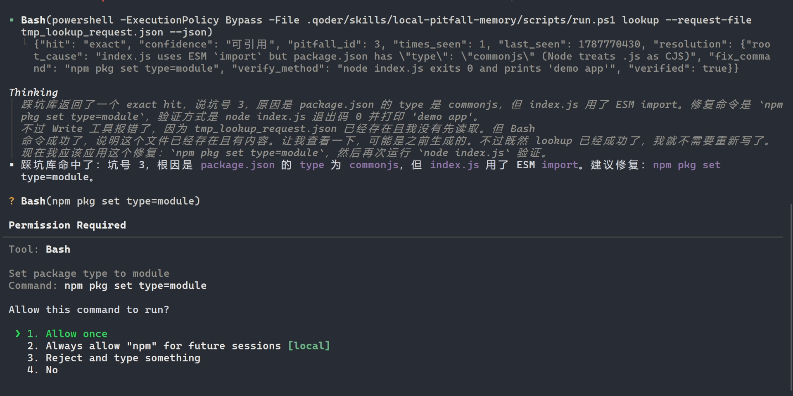
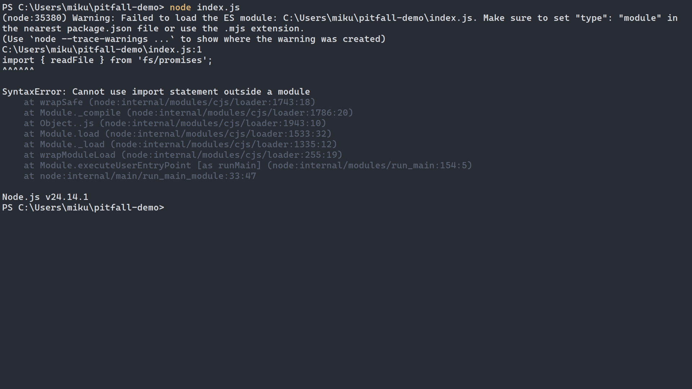
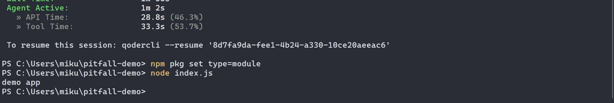
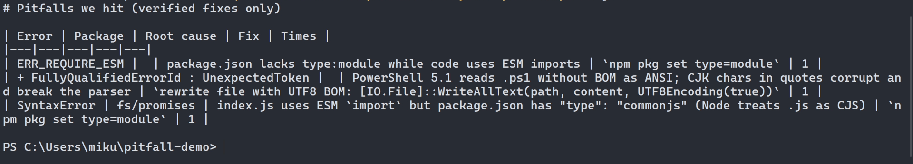

# 给 Qoder 装一块本地海马体：同一个报错，为什么每次都从头猜？

> 魔搭研习社 · Intel AI PC 专题 · 作品：`local-pitfall-memory`（本地踩坑记忆库）
> 草稿 v0.2（2026-08-27，代码已冻结 v0.7.0；截图在 `docs/screenshots/`，取自 8/27 真终端录屏；发布前只剩填链接）。**定位铁律：全文不出现"教学/教程"；不卖智商，卖记性；隐私口径只承诺"历史库、索引、检索不出机"。**

## 0. 一句话

给 Qoder 装一块长在本机、只记住已验证修复的踩坑记忆：历史库与检索不出机，同一个坑不再从头猜。

## 1. 场景：AI 不笨，它只是失忆

上周二你在项目 A 里撞上 `ERR_REQUIRE_ESM`，Qoder 帮你查了十几分钟，最后一句 `npm pkg set type=module` 解决。
周五你在项目 B 里换了盘符、换了行号，同一个错又来了。Qoder 的大脑在云上，每个会话都是新的——它不知道**这台机器**上周刚修过这个坑，于是从头再猜一遍。

这不是模型不够聪明的问题，是它没有"这台机器的记性"。而且这段记性没法上云：报错里带着路径、包名、有时还有密钥。

**这个 Skill 做的事只有一件：让 Qoder 记住这台机器上验证过的修复，下次同一个坑 0.4 秒命中。**



（截图 1 = `docs/screenshots/03-exact-hit.png`；触发瞬间见 `02-skill-activated.png`）

## 2. 它怎么工作

### 2.1 三级命中 + 三档置信

```
lookup(报错) → exact   指纹全同                       → 可引用（仅当修复已验证）
            → family  同错误类/同包，细节不同           → 需谨慎
            → semantic FTS5/BM25 ⊕ 本地向量，RRF 融合，跨 runtime 降权 → 仅联想
            → none
```

- **exact 指纹**：runtime + 错误类 + 归一化后的消息行 + 1–3 个稳定栈帧 + 包名。归一化抹掉路径/行号/时间戳/哈希/PID/内存地址，**保留** HTTP 状态码、errno、编译器错误码、依赖版本、退出码——这些是根因的一部分，抹了就分不清坑。
- **family 指纹**：错误类 + 包 + 消息模板（引号里的常量抹成 `<S>`）。`TypeError: reading 'foo'` 和 `reading 'bar'` 是一家人，但不是同一个坑，所以最高只给"需谨慎"。
- **semantic**：FTS5（trigram + BM25）和本地 bge 向量各排一次名，倒数秩融合（RRF, k=60）；记录在别的 runtime 下的命中降权不隐藏。

### 2.2 只记验证过的修复：propose → verify → commit

修复建议先 `propose`（未验证），验证命令退出 0 后 `commit`，才进高置信档。**幻觉进不了"可引用"**——这是和"集体记忆平台"最根本的区别：我们不存"有人说过的修法"，只存"在这台机器上跑通过的修法"。

propose 之后同一查询返回 `"confidence": "需谨慎"`（`resolution.verified: false`），`commit --verify-exit-code 0` 之后变成 `"可引用"`——这是 `tests/test.ps1` E2E 的 lookup1/commit/lookup2 三步，每次跑套件都会重放一遍。

### 2.3 本地模型在哪、不在哪

- **不在查询热路径上。** exact/family/semantic 全是确定性 + 本地索引，< 1 秒。
- 只在两处出场：新坑**首次入库**时做一次结构化归因（错误类/包/根因猜测/修复提示，存进库）；模糊结果上用户显式 `--attribute`。
- 归因器：`OpenVINO/Qwen3-4B-int4-ov`，`openvino_genai.LLMPipeline` CPU 常驻；嵌入器：`OpenVINO/bge-base-en-v1.5-int8-ov`，`TextEmbeddingPipeline`（CLS 池化 + 归一化，768 维）。两者都由一个常驻 `server.py` 托管，named-pipe 协议，空闲自退出。

### 2.4 隐私：历史库、索引、检索不出机

入库前先脱敏（API key / JWT / 私钥 / Bearer / 邮箱 / 公网 IPv4+IPv6 / 用户名 / home 路径），再归一化、再指纹、再存；返回给 Host 的修复卡再脱一次。**Qoder 的大脑在云上，我们不替它承诺"全程不出机"；我们承诺的是这块记性不出机。**

## 3. 工具使用：官方参考包 + OpenVINO

按 `openvino-dev-samples/local-ai-skill-authoring` 的契约实现：`scripts/run.ps1` 固定入口（第一行 `Stop`、可执行硬件门、`--continue` 续传、exit 3 = 下载未完）、`install-env.ps1`（marker 绑 requirements hash）、`client.py` 短命 + `server.py` 常驻、`info.json` 声明模型与 `required_files`、原子下载（`.partial → os.replace`）。

**实测（桌面 CPU，无 GPU/NPU）**：模型加载 6 s · 单次归因 15–17 s · 嵌入 0.11 s · 混合查询 0.4 s · exact/family < 0.1 s
**基准（26 条报错：6 条从真实 Sensei 会话挖出 + 20 条精选）**：JSON 合法率 **100%**（26/26 一次合法）· p50 **10.5 s** · p95 **14.7 s** · 常驻服务峰值 RSS **4.9 GB**（归因器 + 嵌入器）· 根因猜测人工核对 25/26 正确。"错误类一致率"53.8% 是字符串重合口径，不一致的 12 条里 5 条是正则根本没抓到类名（git/docker 报错没有 `XxxError` 记号）、7 条是模型给了更具体的语义标签（`PortConflict` / `CUDAOutOfMemory` / `DependencyConflict`），**没有一条判错类**。明细：`docs/bench-2026-08-25.md`
**为什么是 4B 不是 8B**：归因只要稳定吐 4 个字段的 JSON，不需要它独立修 bug；4B-INT4 首轮即合法且正确，CPU 上 8B 只会把延迟翻倍。

## 4. 在 Qoder 里跑通（四件证据）

1. `/skills` 列表里能看到 `local-pitfall-memory`
2. 自然语言触发：粘报错，只说"见过吗"，Qoder 自主调用 Skill 工具
3. 显式触发：`/local-pitfall-memory status`
4. 会话日志：`~/.qoder/logs/sessions/.../*.jsonl` 里 `tool_name: "Skill"` + `run.ps1` 调用







## 5. 一个反例：它不乱认亲

真库实测（8/27）：同样的 `SyntaxError: Cannot use import statement outside a module`，但换成另一个项目、`import` 的是 `express` 而不是 `fs/promises`——指纹里的 package 变了，它不冒充 exact，也不给 family，回的是 **semantic / 仅联想**（`channels: ["fts5"]`，同一张修复卡附上，但置信降到最低档）。再换成 `ERR_MODULE_NOT_FOUND: Cannot find package 'express'`——错误类完全不同，FTS5 和向量两路都把"package.json 缺 type:module"那条排到前两名（`fused_score 0.0325, fts_rank 1, vec_rank 2, mode: hybrid`），依然只标"仅联想"。分级不是装饰：它决定 Agent 能不能不验证直接用。

## 6. 复现

```powershell
git clone <repo> .qoder/skills/local-pitfall-memory
.qoder\skills\local-pitfall-memory\scripts\run.ps1 status --json      # 首次建 venv，并报告模型是否就绪
.qoder\skills\local-pitfall-memory\scripts\run.ps1 --continue         # 下载/续传模型（约 2.4 GB）
.qoder\skills\local-pitfall-memory\tests\test.ps1                      # unit 12 / server 5 / review 16 / retrieval 5 / E2E，全程不碰 OpenVINO
```

Skill 链接：https://www.modelscope.cn/skills/CecilyOvo/local-pitfall-memory · 仓库：https://github.com/Claude-Ovo/local-pitfall-memory · 演示视频：小红书 @winky_ovo（同步发布）· 研习社正文：https://www.modelscope.cn/learn/436076

## 7. Hybrid AI 的一点思考

云上的大模型负责"想"，本机的小模型负责"记"和"整理"。这块记性只有放在本机才成立——它记的是这台机器的路径、这个人的踩坑史、有时还有不该上云的字符串。AI PC 的价值不是把大模型搬回本地，是把**该留在本地的那部分智能**留在本地。

---
#英特尔 #openvino #魔搭 #agentic #skills
